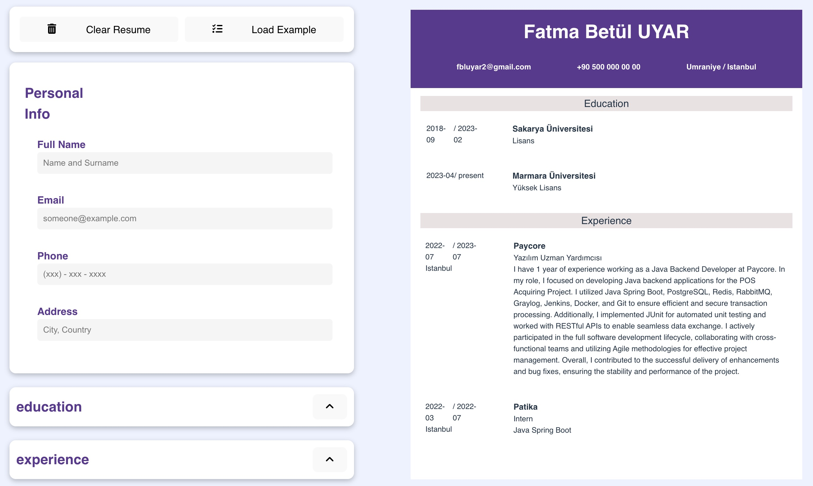

# Odin Project CV Application

This project is a CV application developed as part of the Odin Project's React course. With this application, you can create a CV containing your personal information and experiences.



## Getting Started

You can get started with this project by cloning it to your local machine or by using the live demo version.

   ## Live Demo
   You can view a live demo of this project  [here](https://cv-application-90949.web.app/).
   

### Prerequisites

To run this project on your local machine, you'll need the following software:

- [Node.js](https://nodejs.org/)
- [npm](https://www.npmjs.com/) or [Yarn](https://yarnpkg.com/)

### Installation

1. Clone this repository to your local machine:

   ```bash
   git clone https://github.com/FatmaBetulUyar/cv-Application.git

1. Navigate to the project directory:
   ```bash
   cd cv-Application
   ```
3. Start the project:
   ```bash
    npm install
    npm start
   ```
   or if you're using Yarn:
  ```bash
    yarn install
    yarn start
  ```
5. Open your browser and go to http://localhost:3000. The application should start.

   ## Usage
   Once the application starts, you can use the appropriate forms to add your personal information, educational history, and work experience. You can add new items under each section by clicking the "Add" button. The information you add will be displayed on the page, and you can edit or delete it as needed.


